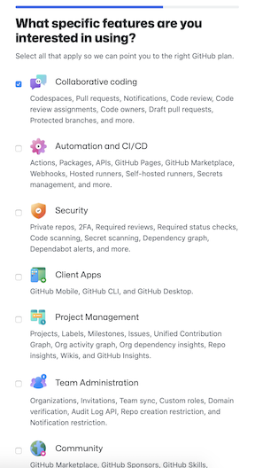
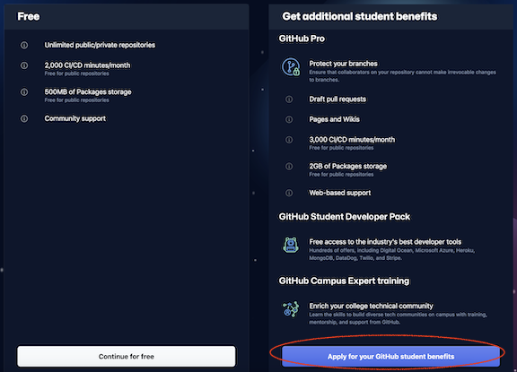
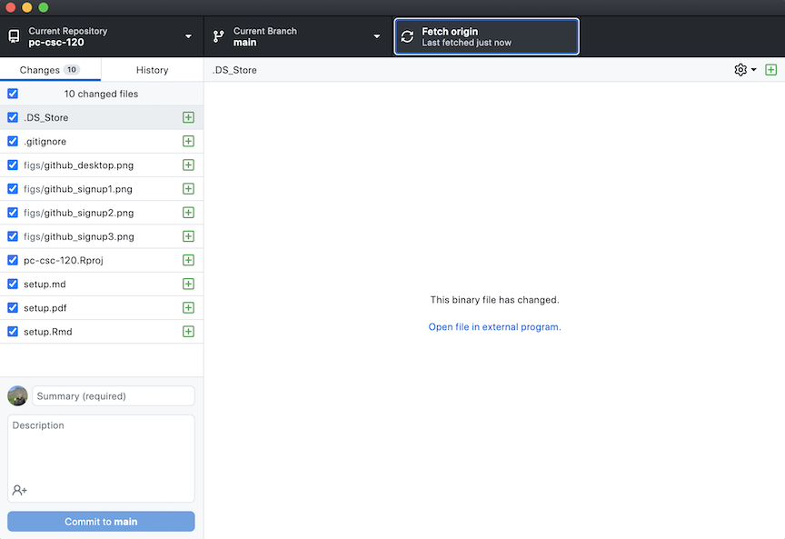
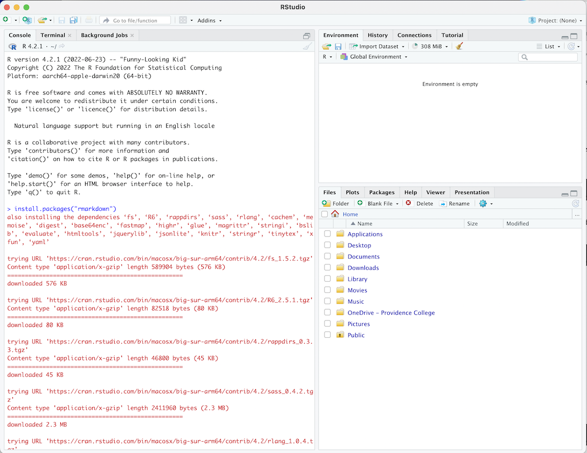

Assignment 1: Software Setup
================

Your first assignment is to set up the software that we will be using
throughout the course. If you get stuck on some weird error or
configuration option, don’t worry too much about it as we will have time
to troubleshoot during class on Friday. You can also come in for help
during office hours. If the regularly scheduled office hours don’t work
for you, then we will find a time that does.

**The one task that you must complete by Thursday is to create a GitHub
account and submit your username as a Canvas “assignment”** so that I
can match usernames to real-life names. You should also do your best to
get through the RStudio section, as you might need to install some bulky
software to get everything working properly. If you’re using a Mac, for
example, you might need to install Command Line Tools, which can take F
O R E V E R. Further, I was unable to test the setup process on a
Windows machine, so I can almost guarantee that unforeseen difficulties
will arise. Get as far as you can so that we have time to head them off.
If you do encounter weird issues, try a restart before you head down a
Google rabbit hole. It works more often than you’d think.

## GitHub

If you don’t have a GitHub account, then create one by clicking the
“Sign up” button [here](https://github.com). Choose whatever username
you like. You will eventually be asked:

 

You can answer as I’ve done above, but it’s not terribly important. Do
tell them you’re a student so that you’re offered GitHub Pro for free
(conditional on submitting proof of your student status). GitHub Pro is
not required for the course but it does give you additional storage and
a few nice features like [GitHub Pages](https://pages.github.com/) at no
cost:



If you already have an account, or if you want to sign up for student
benefits later, you can do so
[here](https://education.github.com/students).

Once you have an account, **enter your username in the Canvas
“assignment” for this week.** Do it now, please.

## GitHub Desktop

Unless you’re a command-line wizard, I strongly recommend installing
GitHub Desktop to manage your GitHub projects (or “repositories”). You
can download it [here](https://desktop.github.com/). Detailed
installation instructions for Mac and Windows are
[here](https://docs.github.com/en/desktop/installing-and-configuring-github-desktop/installing-and-authenticating-to-github-desktop/installing-github-desktop).
It’s not available for Linux, but if you’re a Linux user then you
probably hate GUIs anyway.

Boot it up to finish installation. When in doubt, use default settings
(i.e., don’t manually configure anything). If you’re using a Mac, move
it to the Applications folder (by default, it downloads to the Downloads
folder, but you definitely shouldn’t keep it there).

Now add your first repository. Go to File \> Clone Repository…, then
choose the URL tab and type `willwerscheid/pc-csc-120` (the course
repository, which you can view online
[here](https://github.com/willwerscheid/pc-csc-120)). This will create a
copy of the repository’s files on your computer. They are now yours to
do with as you will.

Before moving on, take a moment to familiarize yourself with the GitHub
Desktop interface:



The top bar shows: 1. The current repository; 2. the current branch (you
won’t need to worry about branches in this course — we will always be
working in the “main” branch); and 3. the “Fetch origin” button. You
will want to get to know this button — when you click it, GitHub Desktop
looks for any recent changes that have been made to the repository (so,
for `pc-csc-120`, changes made by me); if it finds any, it updates your
copy so that it’s in sync with the original repository (mine). I will be
making frequent additions and changes to the repository, so you should
be fetching regularly.

Next, what you see under “Changes” are the files I’ve added while
writing up this assignment. In brief, the way GitHub (or more generally,
git; or more generally still, version control) works is that once you’ve
made some changes that you want to keep, you “commit” them to your
repository. This creates a new version of the repository without erasing
the memory of previous versions, which is nice when you make a change
that you later discover has broken everything. In that case, you can
undo the commit by “reverting” it. But note that these reverts are
themselves commits\! Git is the punishing superego that remembers
everything you do: both your mistakes and your clumsy attempts to undo
your mistakes.

Not all of the changes I’ve made will make it into the final version,
and I won’t commit my changes until I have a satisfactory draft version.
When I’m ready, I’ll commit within GitHub Desktop by giving the changes
a title (under “Summary”), adding some details (under “Description”),
and then clicking “Commit to main.” Since you are visitors from the
future, you can go to the “History” tab to find out what I’ve decided to
do.

When you start doing your own commits, **always take time to write a
good title and description.** Nothing is worse than having to figure out
which one of your ten commits titled “yet another commit, yawn emoji” is
the one that broke everything.

**Do not make any commits to the `pc-csc-120` repository.** This is for
your sake, not mine, as it won’t change anything in the original
repository; it will only cause problems when you attempt to fetch from
origin later. You will have your own repositories to abuse later; this
one is mine. If you do accidentally commit something, then you can undo
the changes by right-clicking the commit and selecting “Revert Changes
in Commit.” If there are multiple commits you need to revert, always
work backwards, reverting one by one until you get to the version you
need. If you’re feeling particularly adventurous, go ahead and try it. I
dare you.

## R

R is the statistical programming language that we will use throughout
the course. To download it, select a mirror from the list
[here](https://cran.r-project.org/mirrors.html). One of the Pittsburgh
choices will probably be fastest. Select your operating system and
download the latest release (as of late August 2022, this was version
4.2.1, a.k.a. “funny-looking kid”). Read the descriptions before
selecting the correct file — note, for example, that there are different
.pkg files for Intel and M1 Macs. Cross your fingers, open the file you
downloaded, and hope that nothing goes wrong. If it does, detailed help
can be found
[here](https://cran.r-project.org/doc/manuals/r-patched/R-admin.html).

## RStudio

RStudio is the IDE (integrated development environment) that we will
use. Some of its many nice features are that it allows you to write and
save scripts (rather than typing instructions into the command line one
at a time) and it has excellent debugging features. We will be using it
a lot in this course\! Choose the free RStudio Desktop version
[here](https://www.rstudio.com/products/rstudio/download/#download) (you
definitely don’t need the $995 Pro version).

Boot it up. If you’re using Mac you might be prompted to install Command
Line Tools in order to be able to use git within RStudio. You should do
this\! But be aware that it can take a long time to download and install
(on a slow connection, it can take hours…). Once you’ve done so, make
sure to restart RStudio before continuing.

Now take another moment to familiarize yourself with the interface.
Here’s what a fresh install looked like for me:



The pane with the Console tab is the most important one: it’s where you
will enter the R commands that you want to execute. You can use it as a
calculator, for example (try it\!). You probably won’t need to worry
about the other tabs there: you can enter system commands in the
Terminal tab, and Background Jobs is exactly what it sounds like: jobs…
in the background…

The upper-right pane will be very useful later. The Environment tab
shows all of the user-created variables that R knows about. For example,
try executing the command `x <- 4`, which creates a variable called `x`
and assigns the value `4` to it. You should see this new variable appear
in the Environment tab. The History tab shows all of the commands that
you’ve executed in your current session, up to and including `x <- 4`.
Don’t worry about the Connections tab. I’ve never used it and you
probably won’t either. You can run some of the RStudio tutorials from
the Tutorial tab if you like, but it’s strictly optional.

Next, notice the little icon just above that pane where it says
“Project: (None).” **In RStudio, you should always work within a
“project,”** which, since we’re using GitHub, will usually coincide
with a repository. Let’s open one now. Click the icon, then “Open
project…”, then navigate to the folder where the `pc-csc-120` repository
was installed (for me, it was installed at
`~/Documents/GitHub/pc-csc-120`). With the folder highlighted, click
“Open.” You should now see the name of the project instead of
“Project: (None).” If you’ve done all the setup needed (including, for
Macs, installing Command Line Tools), you should also see a Git tab
appear in the upper-right pane. We will explore this tab on Friday.

You will also see some changes in the lower-right pane. The project
directory is now your working directory, and the files in that directory
will appear in the Files tab. We will get to other tabs momentarily, but
first we need to install…

## R Markdown

While R includes many useful functions out of the box, it’s the number
and variety of R packages available online that really makes it shine.
In essence, a “package” is a collection of functions that are
conveniently distributed as a single bundle. The first package we will
install is R Markdown, which makes it very easy to write up reports in
RStudio using a mixture of code snippets and textual commentary (for
example, I wrote up this assignment using R Markdown). To install it,
you simply need to type into your RStudio console:

``` r
install.packages(rmarkdown)
```

Do so now. Note that R Markdown needs a number of other packages to
function, and these will be installed at the same time. You can see all
of your installed packages by going to the Packages tab in the
lower-right pane. But just because you’ve installed a package doesn’t
mean that you can use it\! One of the packages that was installed for me
at some point during setup is called `class`; to use the functions in
that package, I need to enter `library(class)` into the console. Try it
with `class` or some other package of your choice, and notice that once
it’s loaded, a checkmark appears next to the package in the Packages
tab. (Some packages, such as `base` and `stats`, are automatically
loaded whenever you boot up an R session.) Alternatively, you can load
packages by simply checking the box in the Packages tab, which enters
the `library` command into the console on your behalf.

Now click the hyperlink for the package you just loaded (in the Packages
tab) to bring up its documentation. Notice that you are now in the Help
tab. You will spend a lot of time here (I still do\!). Under “Help
Pages” you will find some of the functions that are now available to
you (and, if the package is well-documented, you should see all of the
functions that are now available). Click into one of the functions, just
to see what R documentation looks like. Next, using the text entry box
next to the magnifying glass, try looking up something like `mean` or
`median`. Don’t worry if you don’t understand all the details at this
point.

The only other tab that you will need to become familiar with is the
Plots tab, which will be useful once we get to the topic of data
visualization. You can permanently ignore the Viewer and Presentation
tabs. I don’t know what they do.

Finally, you can customize the appearance of RStudio using the various
options under the View menu… but maybe don’t rearrange the panes until
you’ve become more familiar with the software (I will be using the
default layout throughout the course and it will be easier to follow
along if you have the same layout). One thing you can do is to change
the color scheme (RStudio \> Preferences… \> Appearance \> Editor
theme). I’ve been told that the cool kids all use dark mode.

## Next Up

In class on Friday, in addition to any troubleshooting we need to do,
you will tie all of the above together by creating an R Markdown
document using RStudio and then adding it to your personal GitHub
repository (which I will create for you after you’ve submitted your
GitHub username on Canvas — HINT HINT). That will be the general
workflow for the course: all future assignments and labs will be
uploaded to a central location on GitHub (where they can be revised up
until the end of the quarter) rather than as individual assignments on
Canvas.

## Review

Know how to answer the following:

1.  What does the “Fetch origin” button do in GitHub Desktop?

2.  What are commits and reverts?

3.  Where does RStudio display the current project?

4.  How do you install and load R packages?

5.  How do you find out what a particular R function does?
